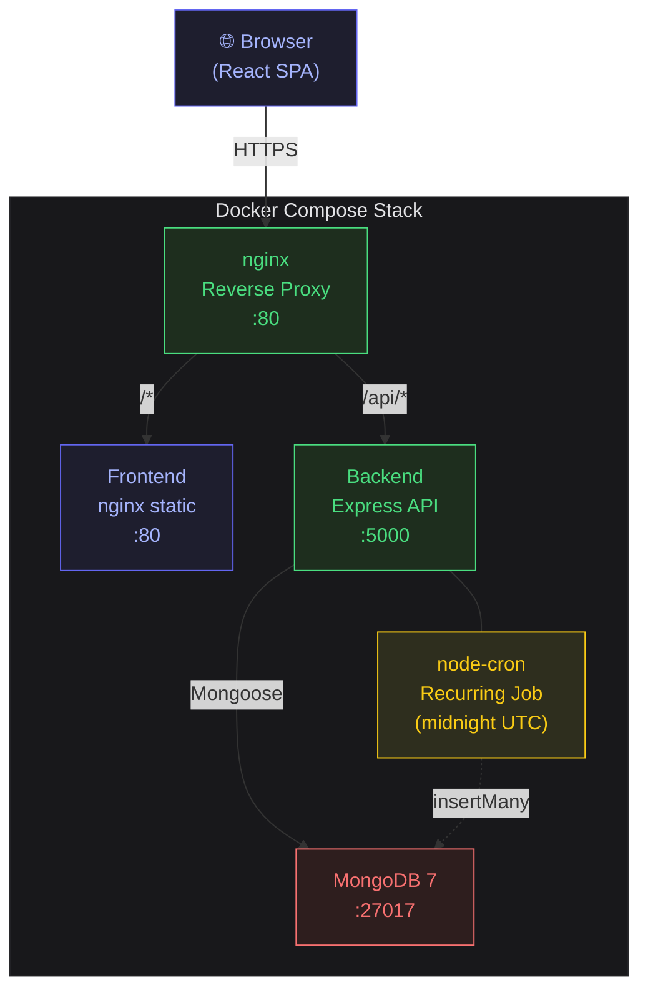
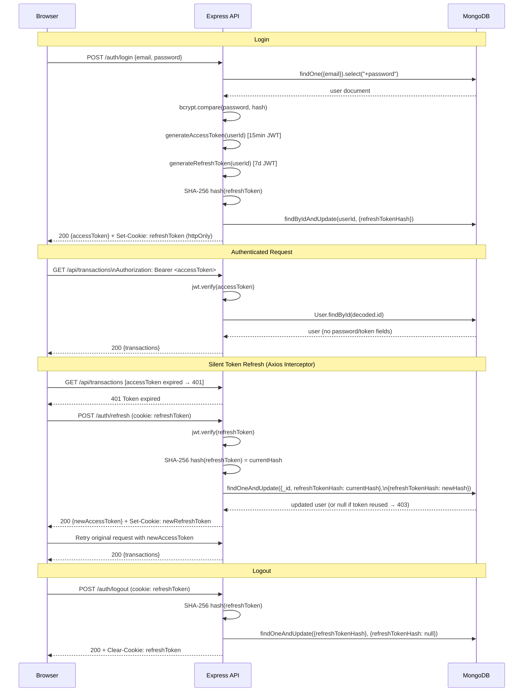
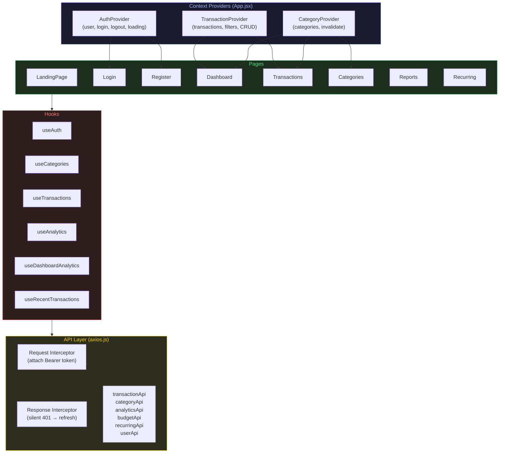
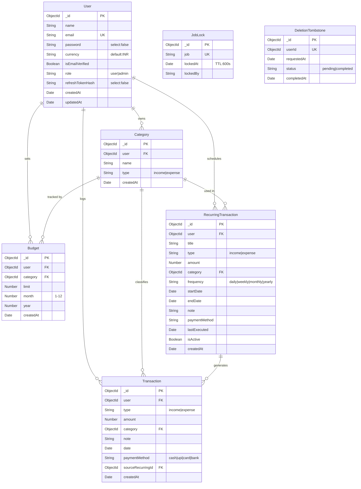
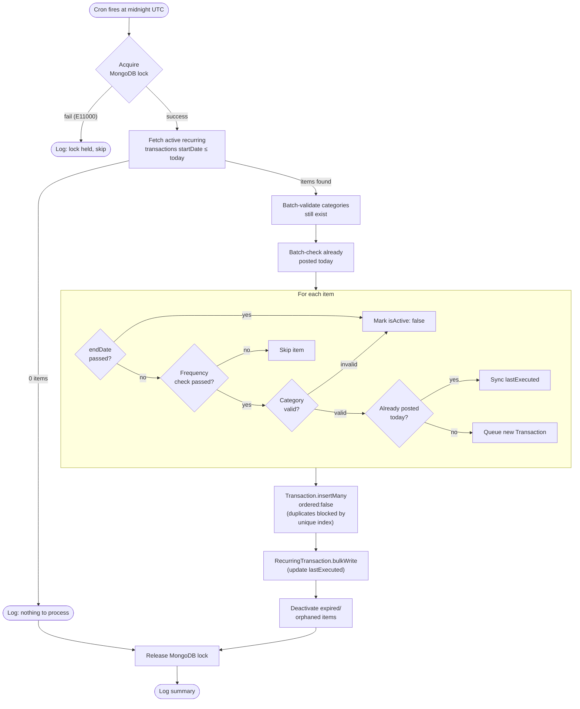
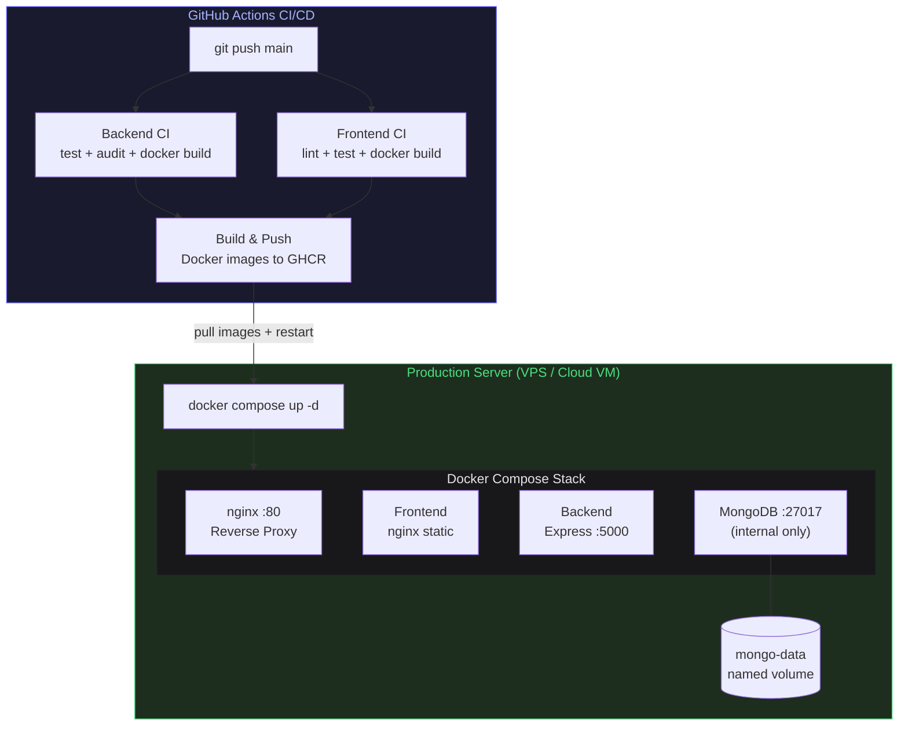

# Architecture

ExpenseTracker is a full-stack MERN application with a clear separation between the React SPA frontend and the Express REST API backend, joined by a nginx reverse proxy in production.

---

## System Overview

---

## Authentication Flow

---

## Frontend Architecture

---

## Backend Architecture

```mermaid
graph LR
    subgraph Request["HTTP Request"]
        R[Incoming Request]
    end

    subgraph Middleware["Middleware Stack"]
        Helmet[Helmet\nSecurity Headers]
        CORS[CORS\nOrigin Check]
        RateLimit[Rate Limiter\n200 req/15min global]
        Logger[pino-http\nStructured Logging]
        BodyParser[express.json\n10kb limit]
        CookieParser[cookie-parser]
    end

    subgraph Routes["Route Layer"]
        AuthR["/auth"]
        TxR["/transactions"]
        CatR["/categories"]
        BudR["/budgets"]
        RecR["/recurring"]
        AnaR["/analytics"]
        UsrR["/users"]
        HlthR["/health"]
    end

    subgraph Auth["Auth Middleware"]
        Protect["protect()\njwt.verify → User.findById"]
    end

    subgraph Validation["Joi Validation"]
        ValMW["validate(schema)\nreq.body or req.query"]
    end

    subgraph Controllers["Controllers"]
        AC[auth.controller]
        TC[transaction.controller]
        CC[category.controller]
        BC[budget.controller]
        RC[recurring.controller]
        AnC[analytics.controller]
        UC[user.controller]
    end

    subgraph Services["Services"]
        AS[analytics.service\n$aggregate pipelines]
    end

    subgraph DB["MongoDB via Mongoose 9"]
        User[User]
        Transaction[Transaction]
        Category[Category]
        Budget[Budget]
        Recurring[RecurringTransaction]
        JobLock[JobLock]
    end

    subgraph ErrorHandling["Error Handling"]
        NotFound[notFound middleware]
        ErrorH[errorHandler middleware]
    end

    R --> Helmet --> CORS --> RateLimit --> Logger --> BodyParser --> CookieParser
    CookieParser --> Routes
    Routes --> Auth --> Validation --> Controllers
    Controllers --> Services --> DB
    Controllers --> DB
    Routes --> ErrorHandling

    style Request fill:#1a1a2e,stroke:#6366f1
    style Middleware fill:#1e2e1e,stroke:#4ade80
    style Routes fill:#2e1a1e,stroke:#f87171
    style Controllers fill:#2e2e1e,stroke:#facc15
    style DB fill:#1a2e2e,stroke:#38bdf8
```

---

## Database Schema

---

## Recurring Job Flow

---

## Deployment Architecture

---

## Key Design Decisions

### Token Security

Refresh tokens are SHA-256 hashed before storage, meaning a database breach does not expose usable tokens. The plaintext token exists only in the httpOnly cookie and in-transit. Rotation on every use means reuse of a stolen token is detected and rejected atomically via `findOneAndUpdate`.

### Distributed Cron Lock

The `JobLock` MongoDB collection with a TTL index prevents duplicate transaction insertion when multiple Node.js processes (horizontal scaling, container restarts) fire the cron simultaneously. The lock is acquired atomically and has a 9-minute TTL — the cron fires daily, so a stale lock from a crashed process auto-expires well before the next run.

### Idempotent Recurring Transactions

A sparse unique index on `(sourceRecurringId, date)` ensures that even if `insertMany` is called twice for the same day (e.g. after a crash mid-job), the database-level constraint prevents duplicates. `ordered: false` allows the batch to continue inserting new items even if some duplicates are rejected.

### Integer Arithmetic for Financial Values

All budget percentage and overspend calculations use integer cents arithmetic (`Math.round(value * 100)`) to avoid floating-point rounding errors that would cause, for example, ₹999.99 + ₹0.01 ≠ ₹1000.00.

### Context vs Module Singleton for Categories

The `CategoryProvider` exposes an `invalidate()` function through React context, replacing the previous module-level singleton cache flag. This is safe across React Strict Mode double-mounts, avoids stale closure bugs, and works correctly when the component tree is partially re-mounted.
